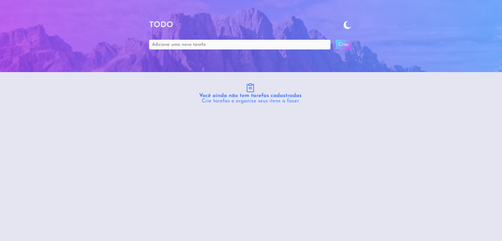

# todo-frontendmentors

Projeto de upgrade do ToDo List criado anteriormente no desafio do módulo 1 do Ignite. O layout dessa aplicação foi baseada no design sugerido pelo [Front-end Mentors](https://www.frontendmentor.io/challenges/todo-app-Su1_KokOW).
 
Essa nova aplicação ganha a funcionalidades de seleção de tema light e dark, sendo possível a construção a partir do uso da biblioteca de estilização in JS (Styled-components). Outra grande diferença entre o [projeto anteriormente desenvolvido](https://github.com/YasminGonc/todo-list-ignite-challenge) foi a divisão dos componentes. Desta forma, há um componente com o input, que recebe a tarefa, e um outro componente para renderizar a lista de tarefas. Fazer essa divisão de componentes me proporcionou colocar em prática a comunicação entre componentes pai e filho e entre irmãos, utilizando o conceito de elevamento de estado. 

## Construção

O projeto seguiu o conceito de mobile-first, portanto é compatível com os tipos de tela mais comuns.
 
A estilização foi feita com styled-components, sendo possível definir os temas dark e light.
 
As seguintes bibliotecas foram utilizadas no projeto:

- Styled-componets;
- Phosphor icons;
- UI components library [Radix](https://phosphoricons.com/), para estilização do checkbox.

## Deploy do projeto

[ToDo List Light/Dark Mode App](https://todo-light-dark-mode.vercel.app/)
 
Caso prefira abrir a aplicação pelo localhost basta digitar no console `npm run dev`.

## Design da aplicação

## Aprendizado

A construção deste projeto permitiu praticar os principais conceitos do React como estados, imutabilidade, componentização e propriedades, métodos de manipulação de arrays como `filter` e `map`, estilização in JS, comunicação entre componentes com o conceito de elevação de estado.

## Dados complementares

- Autor: [Yasmin](https://www.linkedin.com/in/yasmin-goncalves/)
- Challenge by: [Front-end Mentors](https://www.frontendmentor.io/challenges/todo-app-Su1_KokOW)
 
